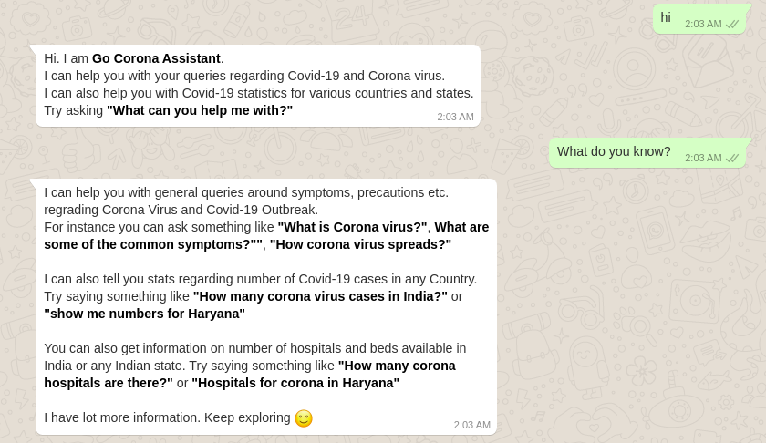

# GoCorona WhatsApp Assistant

## How to use?

1) Save +14155238886 with name **GoCorona** in your phone's contact list.
2) Send a WhatsApp message to this number now. Message - "join star-part" (without quotes). This is necessary to connect with GoCorona bot. It is just to join the application's sandbox.
3) You will now receive a reply from Twilio Sandbox.
4) You are all set now. Just say Hi and get started. 

## Description

GoCorona is a Whatsapp chatbot assistant which is capable of answering general queries regrading Corona Virus and Covid-19 Outbreak.
For instance you can ask something like **"What is Corona virus?"**, **What are some of the common symptoms?""**, **"How corona virus spreads?"**

It can also tell you stats regarding number of Covid-19 cases in any Country. Try saying something like **"How many corona virus cases in India?"** or **"show me numbers for Haryana"**

You can also get information on number of hospitals and beds available in India or any Indian state. Try saying something like **"How many corona hospitals are there?"** or **"Hospitals for corona in Haryana"**

## Getting started

Repository contains a DialogFlow .zip model. Just import it in your DialogFlow agent and use `index.js` inside `/src` to code fulfilments. 

## Screenshots

